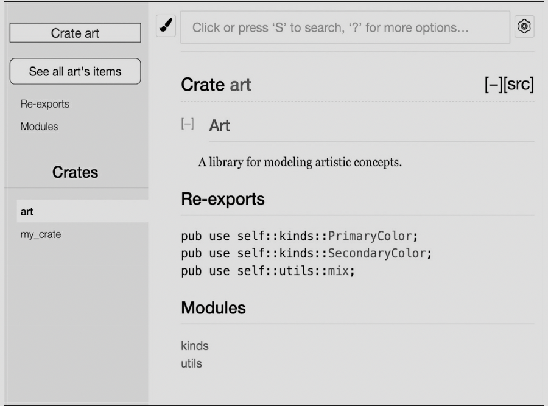
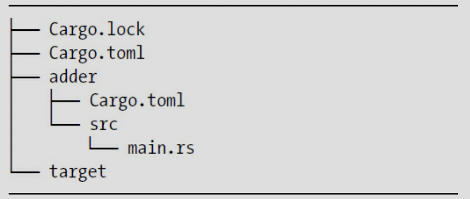

# MORE ABOUT CARGO AND CREATES.IO, ch 14


we will discuss ..

* customize your build through release profiles.

* publish libraries on [*https://crates.io/*](https://crates/io/).

* Organize large projects with workspaces. 

* Install binaries from [*https://crates.io/*](https://crates/io/).

* Extend Cargo using custom commands. 

* full explanation of all its features. [*https://doc.rust-lang.org/cargo/*](https://doc.rust-lang.org/cargo/).


### Customizing Builds with Release Profiles. 

```sh 

Cargo.toml

[profile.dev]
opt-level = 0

[profile.release]
opt-level = 3

```

* **cargo build** command is useally for development.

* **cargo build --release** is for the release. 

* we can controll *opt-level* setting. ( 0 to 3 ).

	* default *opt-level is zero*, faster compiling than upper number. 


### Publishing a Crate to Crates.io 


1. Making Useful Documentation Comments. 

	* *documentaion comment* - generate **HTML** documentation. 
	* example of documenting the source code. 
	* documenting use three slashes. 
	* description of what the **add_one** function does. 
	* start a section with the heading **Examples**
	* demonstrates how to use the **add_one** function. 
	* we can generate by running **cargo doc** > *target/doc* directory
	* more convenience, running **cargo doc --open** 

```rs 

/// Adds one to the number given.
///
/// # Examples
///
/// ```
/// let arg = 5;
/// let answer = my_crate::add_one(arg);
///
/// assert_eq!(6, answer);
/// ```

pub fn add_one(x: i32) -> i32 {
    x + 1
}

```
	


### Commonly Used Sections

**Panics** , **Errors**, **Safety** 


### Documentation Comments as Tests 

* adding example code blocks to your documentation comments can help demonstrate how to use your library, and doing so has an additional bonus: running **cargo test** will run the code examples in your documentation as tests. 

### Commenting Contained Items 

* Another style of doc comment, //!, adds documentation to the item that contains the comments rather than adding documentation to the items following the comments. We typically use these doc comments inside the crate root file (src/lib.rs by convention) or inside a module to document the crate or the module as a whole.


```rs 
//! # My Crate
//!
//! `my_crate` is a collection of utilities to make performing certain
//! calculations more convenient.
 /// Adds one to the number given.
// --snip--

```


### Exporting a Convenient Public API with pub use 

* you might want to organize your structs in a hierarchy containing multiple levels. 
	* people could have trouble finding out. 

* the structure of your public **API** is a major consideration when publishing a crate. 

* structure *isn't* convenient for others to use from another library, you don't have to rearrange your internal organization: instead, you can re-export items to make a public structure that's different from your private structure by using **pub** use.


```rs 

//! # Art
//!
//! A library for modeling artistic concepts.
 pub mod kinds {
    
    /// The primary colors according to the RYB color model.
    pub enum PrimaryColor {
        Red,
        Yellow,
        Blue,
    }

    /// The secondary colors according to the RYB color model.
    pub enum SecondaryColor {
        Orange,
        Green,
        Purple,
    }
}


pub mod utils {
    use crate::kinds::*;
    /// Combines two primary colors in equal amounts to create
    /// a secondary color.
    pub fn mix(c1: PrimaryColor, c2: PrimaryColor) -> SecondaryColor {
        // --snip--
    }
}


```


* Note that the **PrimaryColor** and **SecondaryColor** types aren't listed on the front page, nor is the **mix** function. 

* we have to click *kinds* and *utils* to see them. 


```rs 

use art::kinds::PrimaryColor;
use art::utils::mix;
 fn main() {
    let red = PrimaryColor::Red;
    let yellow = PrimaryColor::Yellow;
    mix(red, yellow);
}


```

* we need to *use* statements that bring the items from **art** into scope. 

* this structure is more relevant to developers working on the **art** crate than to developers using the **art** crate. 

* developers have to figure out where to look, and the structure is inconvenient because developers must specify the module names in the **use** statements. 

* To remove the internal organization from the public **API**, we can modify the **art** crate code to add **pub use** statements to re-export the items at the top level. 


```rs 

//! # Art
//!
//! A library for modeling artistic concepts.

pub use self::kinds::PrimaryColor;
pub use self::kinds::SecondaryColor;
pub use self::utils::mix;

pub mod kinds {
    // --snip--
}

pub mod utils {
    // --snip--
}


```



* now the **art** crate users can still see and use the internal structrue. 


### Setting Up a Crates.io Account

* before you publish any crates, you need to crate an account on [*https://crates.io*](https://crates.io) and get an **API** token. 

```sh

cargo login abcdefgadsf123 // api key from crates.io 

```

* this command will inform Cargo of your API token and stroe it locally in ~/.cargo/credentials. 

### Adding Metadata to a New Crate 

* adding it to the [package] section of the crate's *Cargo.toml* file. 

* your crate will need a unique name. (you need to search it before publish)

	* once a crate name is taken, no one else can pblish a crate with that name. 

* license [*http://spdx.org/licenses/*](http://spdx.org/licenses), you need to check and adding it. 

	* also you can adding a license file. 


```sh 

Cargo.toml

[package]

name = "guessing_game"

version = "0.1.0"

authors = ["Your Name <you@example.com>"]

description = "A fun game where you guess what number the computer has
chosen."

license = "MIT OR Apache-2.0"

edition = "2018"
 
[dependencies]

```

### Publishing to Crates.io 

* publish is permanent. 

* cargo publish command will upload your crates. 

### Publishing a New Version of an Existing Crate 

* when you have been made changes to your crate and are ready to release a new version, you change the **version** value specified in your *Cargo.toml* file and republish. 

* Use the Semantic Versioning rules at [*http://semver.org/*](http://semver.org/).

### Removing Versions from Crates.io with cargo yank 

* you can not remove previous versions of a crate, you can prevent any future projects from adding them s a new dependency. 

* In such situations, Cargo supports *yanking* a crate version. 

```sh 

cargo yank --vers 1.0.1 

cargo yank --vers 1.0.1 --undo 

```

### Cargo Workspaces 

* Cargo offers a feature called *workspaces* that can help manage multiple related packages that are developed in tandem. 

### Creating a Workspace 

* we will have a workspace containing a binary and two libraries 

```sh 

mkdir add 

cd add

vi Cargo.toml 

//in Cargo.toml

[workspace]

members = [

	"adder",
]

```

```sh 

$ cargo new adder

// then cargo build, inside or outside of adder. 

```




* the workspace has one *target* directory at the top level for the compiled artifacts. 

* **adder** crate does not have its own *target* directory, Even if we were to run **cargo build** from insdie the *adder* directory. it would endup *add/target*.

	* the crates in a workspace are meant to depend on each other. 

	* if each crate had its own *target* directory, each crate would have to recompile each of the other crates in the workspace to have the artifacts in its own *target* directory. 

	* by sharing one *target* directory the crates can avoid unnecessary rebuilding. 

### Creating the Second Crate in the Workspace 

* add top-level Cargo.toml on the **members** list - "add-one"


```rs 
members = [

	"adder",
	"add-one",
]

```

```sh

$ cargo new add-one --lib 

```

 


* in the add-one/src/lib.rs 

* add add_one function that gets one parameter then add 1. 


```sh 

// in the adder/Cargo.toml 

[dependencies]

add-one = { path = "../add-one"}

```


```rs 

//adder/src/main.rs

use add_one;

fn main() {

	let num = 10;

	println!("Hello, world! {} plus one is {}!", num, add_one::add_one(num));

}


```

* **cargo build** in the top-level *add* directory 

```sh 

// -p ( package adder )
$ cargo run -p adder 

```

### Depending on an External Crate in a Workspace 

* Notice that the workspace has only one *Cargo.lock* file at the top level of the workspace rather than having a *Cargo.lock* in each crate's directory. 

	* this ensures that all crates are using the same version of all dependencies. 

* if we add **rand** crate to the *adder/Cargo.toml* and *add-one/Cargo.toml* files, Cargo will resolve both of those to one version of **rand** and record that in the one *Cargo.lock*.

* we can not use it in other crates in the workspace unless we add **rand** to their *Cargo.toml* files.

	* we do not need download it again. 

### Adding a Test to a Workspace 

```rs 

//add-one/src/lib.rs
pub fn add_one(x: i32) -> i32 {
    x + 1
}

#[cfg(test)]
mod tests {
    use super::*;
 
 #[test]
    fn it_works() {
        assert_eq!(3, add_one(2));

	}
}

```

* **cargo test** in the top-level *add* directory.

* we can test by using the **-p** flag for the crate that we want to test. 

### publish tip

* you can not publish **cargo publish --all.

* you should publish on each directory of Cargo. 

### Installing Binaries from Crates.io with cargo install 

* the ** cargo install ** command allows you to install and you binary crates locally. 

* note that you can only install packages that have binary targets. 

* A *binary target* is the runnable program otherwise library is not. 

* *README* file has infomation about a crate. 

* installed binaries stored in the installation root's *bin* folder. 

* if you installed Rust using **rustup** and do not have any custom configurations, this directory will be *$HOME/.cargo/bin*. 

	* ensure that directory is in your **$PATH** to be able to run programs you have installed with **cargo install**.


example) 
```sh

$ cargo install ripgrep 

Updating registry `https://github.com/rust-lang/crates.io-index`
 Downloading ripgrep v0.3.2
 --snip--
   Compiling ripgrep v0.3.2
    Finished release [optimized + debuginfo] target(s) in 97.91 secs
Installing ~/.cargo/bin/rg

```

you can use **rg --help**   


### Summary 

* customizing builds with profile. 

* publishing a crate to crates.io. 

	* documentation comment - /// 
	* generate by running **cargo doc** 
	* more convenience, running **cargo doc --open** 
	* commenting contained items //! 

* exporting a public API with pub use. 

* setting up a crates.io account. 

* adding metadata in cargo.toml. 

* publishing a new version of an existing crate. 

* removing versions from crates.io with cargo yank. 

* creating a workspace. 

	* creating the second crate in the workspace. 
		* members = ["a", "b", ..] in carglo.toml 

* adding a test to a workspace. ex) using -p flag


