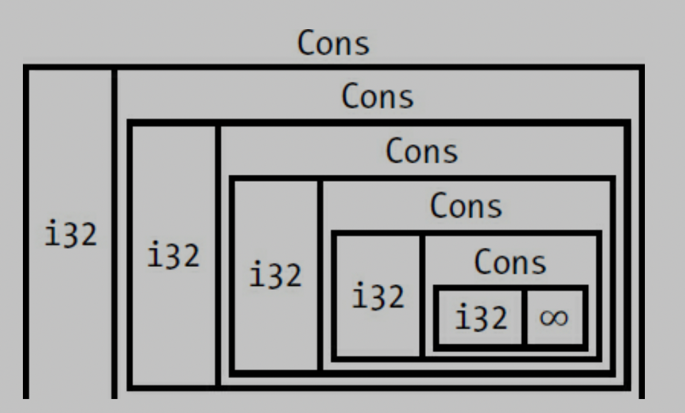

# SMART POINTERS, ch 15

a pointer is a general concept for a variable that contains an address in memory. 
this pointer is point at some other data. 

*Smart Pointers* are data structrue not only act like pointer but also have additional metadata and capabilities. 

*reference counting* smart pointer type. 
	* having a multiple owners of data by keeping track of the number of owners and, when no owners remain, cleaning up the data. 


#### difference 
- references are pointers that only borrow data, in contrast smart pointers own the data they point to. 


ex) String, Vec<T> 
	* String ensuring its data will always be valid UTF-8 

* Smart pointers are usually implemented using structs. 
	* smart pointers implement the Deref and Drop traits. 

		* dref trait is let smart pointer act like a reference. 
		* drop trait allows you to customize the code that is run when an instance of the smart pointer goes out of scope.  


We'll cover the most common smart pointets in the standard library: 

* Box<T> for allocating values on the heap 

* Rc<T>, a reference counting type that enables multiple ownership

* Ref<T>, and RefMut<T>, accessed through RefCell<T>, a type that enforces the borrowing rules at runtime instead of compile time. 

* In addition, we'll cover the interior mutaiblity pattern where an immutable type exposes an API for mutating an interior value. 

* reference cycles : how they can leak memory and how to prevent them. 


### Using Box<T> to Point to Data on the Heap 

* storing data on the heap rather than the stack. 

* Boxes don't have performance overhead

* use case of Box<T>

	* when you have a type whose size can't be known at compile time and you want to use a value of that type in a context that requires an exact size
		
		* Enabling Recursive Types with Boxes 

	* when you have a large amount of data and you want to transfer ownership but ensure the data won't be copied when you do so 
		* transferring ownership of large amount of data can take a long time because the data is copied around on the stack. To improve performance in this situation, we can store large amount of data on the heap in a box. then, only the small amount of pointer data is copied around on the stack, while the data it references stays in one place on the heap. 

	* when you want to own a value and you care only that it's a type that implements a particular trait rather than being of a specific type
		* chapter 17. 


### Using a Box<T> to Store Data on the Heap 

Before  we discuss this use case for Box<T>, cover syntax and how to interact with values stored within a Box<T>. 


```rust

let v = Box::new(value);

```

### Enabling Recursive Types with Boxes

Rust does not know how much space a value of a recursive type needs -> boxes have a known size. 

you can have recursive type in boxes. 


```rust

enum List {
	Cons(i32, List),
	nil,
}

// this can not compile because in the list of Cons's size is not known at compile time. 


enum List {
	Cons(i32, Box<List>),
	nil,
}

```

<p> </p>
ex) image of List 


### Computing the Size of a NonRecursive Type 

```Rust

enum Message {
    Quit,
    Move { x: i32, y: i32 },
    Write(String),
    ChangeColor(i32, i32, i32),
}

```

to determine how much space to allocate for a Message value, Rust goes through each of the variants to see which variant needs the most space. 

contrast, Cons list need size of i32 and size of List. the important thing is the size of list is not known at compile time when you declear the enum.

### Using Box<T> to get a Recursive type with a known size 

store the value indirectly by storing pointer to the value. 

Box<T> is a pointer, rust know much size it needs. 

so inside of List of Cons, we can put Box<T> that pointer to the value of List and so on. 

```rs
enum List {
    Cons(i32, Box<List>),
     Nil,
}

use crate::List::{Cons, Nil};

fn main() {
    let list = Cons(1,
        Box::new(Cons(2,
            Box::new(Cons(3,
                Box::new(Nil))))));
}

```

so it looks like this. 

<p>_type.png" alt="box_type" width = 300 /> </p>

usize is the pointer that point to the value in the heap memory. 

### Treating smart pointer like a regular reference with the deref trait. 

by implementing deref trait you can use it like a regular reference and also used as smart pointer.


### Following the pointer to the value with the dereference operator.

```rs

fn main() {

	let x = 5;
	let y = &x;

	assert_eq!(x, y);
}

```

* this code will fail because x and y have different type. 
	* x is i32, y is reference i32. 

### Using Box<T> like a reference  

```rs

fn main() {

	let x = 5;
	let y = Box::new(x);  // y is the pointer to the value on the heap

	assert_eq!(x, *y);
}

```

### Implementing the deref 


```rs 

use std::ops::Deref;

struct MyBox<T>(T);

impl<T> MyBox<T> {
	fn new(val : T) -> MyBox(T) {
		MyBox(val)
	}
}


impl<T> Deref for MyBox<T> {
	type Target = T; 

	fn deref(&self) -> &Target {
		&self.0
	}

}

fn main() {

	let a = 5;
	let b = MyBox(a);

	assert_eq!(a, *b);

}


```

dref impl makes * operator returns reference to the value instead of return value without reference. 
because it cause deref fn takes ownership of parameter.

it actually looks like this *(a.deref()).


### Implicit deref coersion with functions and methods 

deref coersion is reference changes into original type that functions and methods expected. 


```Rust, editable 

fn main() {

	fn hello(val : &str) {
		println!(" hey, {}", val);
	}


	let a = String::new("whats up");

	hello(&a);
	
	// &(*a)[..] -> if we don't use deref coercion we should write down as it is. 
}


```

std lib also implement deref coersion on String struct thats why string to reference can be str to reference.  


### How deref coercion interact with mutability 


* From &T to &U when T: Dref<Target=U> 

* From &mut T to &mut U when T: DrefMut<Target=U>

* From &mut T to U when T: Dref<Target=U>
	* note that mutable references can be changed into immutable but reverse is not possible. 
	* think about ownership and borrowing rules. 


### Running code on cleanup with the drop trait 


* drop trait can be useful when we release resources like files or network connections. 

* drop trait is almost used to implement on smart pointer this is why we are introducting the trait in this chapter. 

	* Box<T> needs to drop to deallocate on heap memory. 


```rs

struct CustomSmartPointer {
      data: String,
  }

impl Drop for CustomSmartPointer {
      fn drop(&mut self) {
        println!("Dropping CustomSmartPointer with data `{}`!", self.data);
      }
  }


```

### Dropping a value early with std::men::drop 

Disabling drop isn't usually necessary; the whole point of the Drop triat is that is's taken care of automatically. 
however, you might want to clean up a value early. 

one example is when using smart pointers that manage locks: you might want to force the drop method that release the lock to run so other code in the same scope can acquire the lock. 

but rust does not let you call the Drop trait's drop method manually; instead you have to call the std::mem::drop function if you want to drop value before the end of the its scope. 

and also using value.drop() method ealy is not allowed.  

```sh 

error[E0040]: explicit use of destructor method
  --> src/main.rs:14:7
   |
14 |     c.drop();
   |       ^^^^ explicit destructor calls not allowed


```
* destructor is the general programming term for a function that cleans up an instance. 
* it causes double free error. rust would still automatically call drop on the value at the end of main. 


```rs 

	 drop(value) // from std::mem::drop , it works. for early droping value 
```

### Rc<T>, the reference counted smart pointer 


use Rc<T> type when we want to allocate some date on the heap for multiple parts of program to read and we can't determine at compile time which part will finish using the data last

* note that Rc<T> is only used in single thread scenario. 


