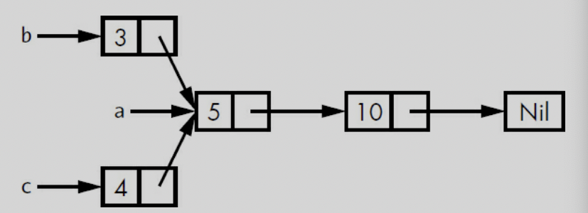

# SMART POINTERS, ch 15

a pointer is a general concept for a variable that contains an address in memory. 
this pointer is point at some other data. 

*Smart Pointers* are data structrue not only act like pointer but also have additional metadata and capabilities. 

*reference counting* smart pointer type. 
	* having a multiple owners of data by keeping track of the number of owners and, when no owners remain, cleaning up the data. 


#### difference 
- references are pointers that only borrow data, in contrast smart pointers own the data they point to. 


ex) String, Vec<T> 
	* String ensuring its data will always be valid UTF-8 

* Smart pointers are usually implemented using structs. 
	* smart pointers implement the Deref and Drop traits. 

		* dref trait is let smart pointer act like a reference. 
		* drop trait allows you to customize the code that is run when an instance of the smart pointer goes out of scope.  


We'll cover the most common smart pointets in the standard library: 

* Box<T> for allocating values on the heap 

* Rc<T>, a reference counting type that enables multiple ownership

* Ref<T>, and RefMut<T>, accessed through RefCell<T>, a type that enforces the borrowing rules at runtime instead of compile time. 

* In addition, we'll cover the interior mutaiblity pattern where an immutable type exposes an API for mutating an interior value. 

* reference cycles : how they can leak memory and how to prevent them. 


### Using Box<T> to Point to Data on the Heap 

* storing data on the heap rather than the stack. 

* Boxes don't have performance overhead

* use case of Box<T>

	* when you have a type whose size can't be known at compile time and you want to use a value of that type in a context that requires an exact size
		
		* Enabling Recursive Types with Boxes 

	* when you have a large amount of data and you want to transfer ownership but ensure the data won't be copied when you do so 
		* transferring ownership of large amount of data can take a long time because the data is copied around on the stack. To improve performance in this situation, we can store large amount of data on the heap in a box. then, only the small amount of pointer data is copied around on the stack, while the data it references stays in one place on the heap. 

	* when you want to own a value and you care only that it's a type that implements a particular trait rather than being of a specific type
		* chapter 17. 


### Using a Box<T> to Store Data on the Heap 

Before  we discuss this use case for Box<T>, cover syntax and how to interact with values stored within a Box<T>. 


```rust

let v = Box::new(value);

```

### Enabling Recursive Types with Boxes

Rust does not know how much space a value of a recursive type needs -> boxes have a known size. 

you can have recursive type in boxes. 


```rust

enum List {
	Cons(i32, List),
	nil,
}

// this can not compile because in the list of Cons's size is not known at compile time. 


enum List {
	Cons(i32, Box<List>),
	nil,
}

```

<p> </p>
ex) image of List 


### Computing the Size of a NonRecursive Type 

```Rust

enum Message {
    Quit,
    Move { x: i32, y: i32 },
    Write(String),
    ChangeColor(i32, i32, i32),
}

```

to determine how much space to allocate for a Message value, Rust goes through each of the variants to see which variant needs the most space. 

contrast, Cons list need size of i32 and size of List. the important thing is the size of list is not known at compile time when you declear the enum.

### Using Box<T> to get a Recursive type with a known size 

store the value indirectly by storing pointer to the value. 

Box<T> is a pointer, Rust compiler does know how much size it needs. 

so inside of List of Cons, we can put Box<T> that pointer to the value of List and so on. 

```rs
enum List {
    Cons(i32, Box<List>),
     Nil,
}

use crate::List::{Cons, Nil};

fn main() {
    let list = Cons(1,
        Box::new(Cons(2,
            Box::new(Cons(3,
                Box::new(Nil))))));
}

```

so it looks like this. 

<p>_type.png" alt="box_type" width = 300 /> </p>

usize is the pointer that point to the value in the heap memory. 

### Treating smart pointer like a regular reference with the deref trait. 

by implementing deref trait you can use it like a regular reference and also used as smart pointer.


### Following the pointer to the value with the dereference operator.

```rs

fn main() {

	let x = 5;
	let y = &x;

	assert_eq!(x, y);
}

```

* this code will fail because x and y have different type. 
	* x is i32, y is reference i32. 

### Using Box<T> like a reference  

```rs

fn main() {

	let x = 5;
	let y = Box::new(x);  // y is the pointer to the value on the heap

	assert_eq!(x, *y);
}

```

### Implementing the deref 


```rs 

use std::ops::Deref;

struct MyBox<T>(T);

impl<T> MyBox<T> {
	fn new(val : T) -> MyBox(T) {
		MyBox(val)
	}
}


impl<T> Deref for MyBox<T> {
	type Target = T; 

	fn deref(&self) -> &Target {
		&self.0
	}

}

fn main() {

	let a = 5;
	let b = MyBox(a);

	assert_eq!(a, *b);

}


```

dref impl makes * operator returns reference to the value instead of return value without reference. 
because it cause deref fn takes ownership of parameter.

it actually looks like this *(a.deref()).


### Implicit deref coersion with functions and methods 

deref coersion is reference changes into original type that functions and methods expected. 


```Rust, editable 

fn main() {

	fn hello(val : &str) {
		println!(" hey, {}", val);
	}


	let a = String::new("whats up");

	hello(&a);
	
	// &(*a)[..] -> if we don't use deref coercion we should write down as it is. 
}


```

std lib also implement deref coersion on String struct thats why string to reference can be str to reference.  


### How deref coercion interact with mutability 


* From &T to &U when T: Dref<Target=U> 

* From &mut T to &mut U when T: DrefMut<Target=U>

* From &mut T to U when T: Dref<Target=U>
	* note that mutable references can be changed into immutable but reverse is not possible. 
	* think about ownership and borrowing rules. 


### Running code on cleanup with the drop trait 


* drop trait can be useful when we release resources like files or network connections. 

* drop trait is almost used to implement on smart pointer this is why we are introducing the trait in this chapter. 

	* Box<T> needs to drop to deallocate on heap memory. 


```rs

struct CustomSmartPointer {
      data: String,
  }

impl Drop for CustomSmartPointer {
      fn drop(&mut self) {
        println!("Dropping CustomSmartPointer with data `{}`!", self.data);
      }
  }


```

### Dropping a value early with std::men::drop 

Disabling drop isn't usually necessary; the whole point of the Drop triat is that is's taken care of automatically. 
however, you might want to clean up a value early. 

one example is when using smart pointers that manage locks: you might want to force the drop method that release the lock to run so other code in the same scope can acquire the lock. 

but rust does not let you call the Drop trait's drop method manually; instead you have to call the std::mem::drop function if you want to drop value before the end of the its scope. 

and also using value.drop() method early is not allowed.  

```sh 

error[E0040]: explicit use of destructor method
  --> src/main.rs:14:7
   |
14 |     c.drop();
   |       ^^^^ explicit destructor calls not allowed


```
* destructor is the general programming term for a function that cleans up an instance. 
* it causes double free error. rust would still automatically call drop on the value at the end of main or scope.  


```rs 

	 drop(value) // from std::mem::drop , it works. for early droping value 
```

### Rc<T>, the reference counted smart pointer 

use Rc<T> type when we want to allocate some data on the heap for multiple parts of program to read and we can't determine at compile time which part will finish using the data last so this is why we use Rc<T> type. 

* Rc<T> allows a single value to have multiple owners, and the count ensures that the value remains valid as long as any of the owners still exist. 

* note that Rc<T> is only used in single thread scenario. 

* what is difference just & and Rc<T> - Rc has multiple ownership 

### Using Rc<T> to share data 

we'll create two lists that share ownership of a third list. 

<p> </p>

*Example* - Two lists, b and c, sharing ownership of a third list, a

```rust

enum List {
    Cons(i32, Box<List>),
    Nil,
}
 use crate::List::{Cons, Nil};

 fn main() {
  let a = Cons(5,
        Box::new(Cons(10,
            Box::new(Nil))));
  let b = Cons(3, Box::new(a));
  let c = Cons(4, Box::new(a));
}

```

 *example* - demonstrating we're not allowed to have two lists using Box<T> that try to share ownership of a third list


```sh 

error[E0382]: use of moved value: `a`
  --> src/main.rs:13:30
   |
12 |     let b = Cons(3, Box::new(a));
   |                              - value moved here
13 |     let c = Cons(4, Box::new(a));
   |                              ^ value used here after move
   |
   = note: move occurs because `a` has type `List`, which does not implement
   the `Copy` trait


```


* a is moved into b and b owns a. when we try to use a again when creating c, we're not allowed to because a has been moved. 

* we could change the definition of Cons to hold references instead, but then we would have to specify lifetime parameters. By specifying lifetime parameters, we would be specifying that every element in the list will live at least as long as the entire list. 

	* the borrow checker wouldn't let us compile let a = Cons(10, &Nil); for example, because the temporary Nil value would be dropped before a could take a reference to it. 


```rust 

enum List {
       Cons(i32, Rc<List>),
       Nil,
   }
 use crate::List::{Cons, Nil};
➊ use std::rc::Rc; // rc is not in the prelude. 
 fn main() {
    ➋ let a = Rc::new(Cons(5, Rc::new(Cons(10, Rc::new(Nil)))));
    ➌ let b = Cons(3, Rc::clone(&a));
    ➍ let c = Cons(4, Rc::clone(&a));
   }


```
 *example* - a definition of list that uses Rc<T> 


* each Cons variant will now hold a value and an Rc<T> pointing to a list. when we create b, instead of taking ownership of a, we'll clone the Rc<List> that a is holding, thereby increasing the number of references from one to two and letting a and b share ownership of the data in that Rc<List>. 

* we'll also clone a when creating c, increasing the number of references from two to three. 

* every time we call Rc::clone, the reference count to the data within the Rc<List> will increase, and the data won't be cleaned up unless there are zero references to it. 

* Rc::clone only increments the reference count and doesn't make a deep copy. 


### Cloning an Rc<T> increases the reference count 

```rs 
let a = Rc::new(Cons(5, Rc::new(Cons(10, Rc::new(Nil)))));

Rc::strong_count(&a);

```

* we can get reference count to call this function - Rc::string_count(&value).

* also has weak_count we will take care of this in later.

* Rc<List> in a has an initial reference count of 1.


### RefCell<T> and the Interior Mutability Pattern 

 *Interior mutability* is a design pattern in Rust that allows you to mutate data even when there are immutable references to that data; normally, this action is disallowed by the borrowing rules. To mutate data, the pattern uses unsafe code inside a data structure to bend Rust’s usual rules that govern mutation and borrowing. We haven’t yet covered unsafe code; we will in Chapter 19. We can use types that use the interior mutability pattern when we can ensure that the borrowing rules will be followed at runtime, even though the compiler can’t guarantee that. The unsafe code involved is then wrapped in a safe API, and the outer type is still immutable.

### Enforcing Borrowing Rules at Runtime with RefCell<T> 

* borrowing rules enforcing at compile time -> references and Box<T>.

* checking the borrowing rules at compile time is the best choice in the majority of cases, which is why this is Rust's default. 

* The advantage of checking the borrowing rules at runtime instead is that certain memory-safe scenarios are then allowed, whereas they are disallowed by the compile-time checks.

* same as Rc<T>, RefCell<T> is used in the single thread. 

### Halting problem..

* The RefCell<T> type is useful when you’re sure your code follows the borrowing rules but the compiler is unable to understand and guarantee that.


### a recap of the reasons to choose Box<T>, Rc<T>, or RefCell<T>: 
* Rc<T> enables multiple owners of the same data; Box<T> and RefCell<T> have single owners.
* Box<T> allows immutable or mutable borrows checked at compile time; Rc<T> allows only immutable borrows checked at compile time; RefCell<T> allows immutable or mutable borrows checked at runtime. 
* Because RefCell<T> allows mutable borrows checked at runtime, you can mutate the value inside the RefCell<T> even when the RefCell<T> is immutable.


### Interior Mutablilty : A Mutable Borrow to an Immutable Value 

* Using RefCell<T> is one way to get the ability to have interior mutability. But RefCell<T> doesn’t get around the borrowing rules completely: the borrow checker in the compiler allows this interior mutability, and the borrowing rules are checked at runtime instead. If you violate the rules, you’ll get a panic! instead of a compiler error. Let’s work through a practical example where we can use RefCell<T> to mutate an immutable value and see why that is useful. 

### A Use Case for Interior Mutability: Mock Objects 

* A test double is the general programming concept for a type used in place of another type during testing. Mock objects are specific types of test doubles that record what happens during a test so you can assert that the correct actions took place. Rust doesn’t have objects in the same sense as other languages have objects, and Rust doesn’t have mock object functionality built into the standard library as some other languages do. However, you can definitely create a struct that will serve the same purposes as a mock object.


```rust

pub trait Messenger {
  fn send(&self, msg: &str);
}
 pub struct LimitTracker<'a, T: 'a + Messenger> {
    messenger: &'a T,
    value: usize,
    max: usize,
}
 impl<'a, T> LimitTracker<'a, T>
    where T: Messenger {
    pub fn new(messenger: &T, max: usize) -> LimitTracker<T> {
        LimitTracker {
            messenger,
            value: 0,
            max,
        }
}
  pub fn set_value(&mut self, value: usize) {
       self.value = value;
 let percentage_of_max = self.value as f64 / self.max as f64;
 if percentage_of_max >= 1.0 {
           self.messenger.send("Error: You are over your quota!");
       } else if percentage_of_max >= 0.9 {
            self.messenger.send("Urgent warning: You've used up over 90% of
your quota!");
        } else if percentage_of_max >= 0.75 {
            self.messenger.send("Warning: You've used up over 75% of your
quota!");
        }
    }
}


```


* we are trying to make an example of RefCell<T> type. so we are using mock struct. 


```rust 
#[cfg(test)]
mod tests {
    use super::*;
  struct MockMessenger {
      sent_messages: Vec<String>,
   }
 impl MockMessenger {
      fn new() -> MockMessenger {
            MockMessenger { sent_messages: vec![] }
        }
    }
 impl Messenger for MockMessenger {
        fn send(&self, message: &str) {
          self.sent_messages.push(String::from(message));
        }
    }
 #[test]
  fn it_sends_an_over_75_percent_warning_message() {
       let mock_messenger = MockMessenger::new();
       let mut limit_tracker = LimitTracker::new(&mock_messenger, 100);
 limit_tracker.set_value(80);
 assert_eq!(mock_messenger.sent_messages.len(), 1);
    }
}


```

* but this code does not compile because MockMessenger struct's send method is immutable ( trait messenger is using immutable self in send method )


```rust 

error[E0596]: cannot borrow immutable field 'self.sent_messages' as mutable
  --> src/lib.rs:52:13
   |
51 |          fn send(&self, message: &str) {
   |                  ----- use '&mut self' here to make mutable
52 |              self.sent_messages.push(String::from(message));
   |              ^^^^^^^^^^^^^^^^^^ cannot mutably borrow immutable field


```

* We also can’t take the suggestion from the error text to use &mut self instead, because then the signature of send wouldn’t match the signature in the Messenger trait definition (feel free to try it out and see what error message you get).


<p> </p>

* I tried to changed to mut but it does not work and i can even understand why.. 

solved.

* the Messensger and LimitTracker and methods are the source code can not change and test code the MockMessenger is implements that for test. 

* in this case we use RefCell for change immutable value to mutable. 


```rust 

mod tests {
    use super::*;
    use std::cell::RefCell;

struct MockMessenger {
      sent_messages: RefCell<Vec<String>>,

}

... 

 self.sent_messages.borrow_mut().push(String::from(message));


```

* we can change it like this and compile with mock struct.


### Keeping Track of Borrows at Runtime with RefCell<T>

* When creating immutable and mutable references, we use the & and &mut syntax, respectively. With RefCell<T>, we use the borrow and borrow_mut methods, which are part of the safe API that belongs to RefCell<T>.

* The borrow method returns the smart pointer type Ref<T>, and borrow_mut returns the smart pointer type RefMut<T>. Both types implement Deref, so we can treat them like regular references.

* When a Ref<T> value goes out of scope, the count of immutable borrows goes down by one. Just like the compile-time borrowing rules, RefCell<T> lets us have many immutable borrows or one mutable borrow at any point in time.


```rust 

impl Messenger for MockMessenger {
    fn send(&self, message: &str) {
        let mut one_borrow = self.sent_messages.borrow_mut();
        let mut two_borrow = self.sent_messages.borrow_mut();
		one_borrow.push(String::from(message));
        two_borrow.push(String::from(message));
    }
}

```

* Creating two mutable references in the same scope to see that RefCell<T> will panic. 

* Notice that the code panic with the message already borrowed: BorrowMutError. This is how RefCell<T> handles violations of the borrowing rules at runtime.

* Catching borrowing errors at runtime may cause mistakes to be found later in the development process and incur a small runtime performance penalty. However, using RefCell<T> allows for the creation of mock objects that can modify themselves and provide more functionality than regular references. Despite its trade-offs, RefCell<T> can be used to achieve this.


### Having Multiple Owners of Mutable Data by Combining Rc<T> and RefCell<T>


Rc<T> is a type that allows multiple ownership of an immutable value, while RefCell<T> is a type that provides interior mutability, allowing for mutable access to a value even when it's immutably borrowed. Combining these types allows for multiple owners of a mutable value.

However, there are some rules to follow when using this combination, such as not creating reference cycles and ensuring that all changes to the value are done through a RefCell<T> borrow. The chapter also covers how to use Rc<T> and RefCell<T> with a tree-like structure and how to avoid deadlocks when using multiple threads.

Overall, this chapter provides a practical guide for combining Rc<T> and RefCell<T> to achieve multiple ownership of mutable data in Rust.


```rust 

#[derive(Debug)]
enum List {
    Cons(Rc<RefCell<i32>>, Rc<List>),
    Nil,
}
use crate::List::{Cons, Nil};
use std::rc::Rc;
use std::cell::RefCell;

fn main() {
   let value = Rc::new(RefCell::new(5));

   // clone value so both a and value have ownership of the value
   // we wrap the list a in an Rc<T> so when we create lists b and c, they can both refer to a. multiple ownership 
   let a = Rc::new(Cons(Rc::clone(&value), Rc::new(Nil))); 

   let b = Cons(Rc::new(RefCell::new(6)), Rc::clone(&a));
   let c = Cons(Rc::new(RefCell::new(10)), Rc::clone(&a));
   *value.borrow_mut() += 10;
   println!("a after = {:?}", a);
   println!("b after = {:?}", b);
   println!("c after = {:?}", c);
}


```


* uses the automatic dereferencing feature we discussed in Chapter 5 (see “Where’s the -> Operator?” on page 94) to dereference the Rc<T> to the inner RefCell<T> value. The borrow_mut method returns a RefMut<T> smart pointer, and we use the dereference operator on it and change the inner value.

	* Chapter 5 of "The Rust Programming Language" book introduces the ownership system in Rust and explains the automatic dereferencing feature. This feature allows us to use the . operator instead of -> to access fields and methods of a struct or an object when working with pointers. Rust automatically inserts a dereference operation when it encounters a . operator on a pointer type, but we can still use the * operator to explicitly access the pointer's inner value. Overall, this feature simplifies working with pointers in Rust.


* The runtime checks of the borrowing rules protect us from data races, and it’s sometimes worth trading a bit of speed for this flexibility in our data structures.

	* In Rust, a data race occurs when two or more pointers access the same memory location concurrently without proper synchronization. Data races can lead to undefined behavior and difficult-to-debug issues. Rust's ownership and borrowing system is designed to prevent data races at compile time by enforcing strict rules on how pointers are used and accessed. Rust's borrow checker ensures that a mutable reference is the only reference to a value at any given time, preventing concurrent writes, and Rust provides synchronization primitives to safely share data across threads and prevent data races. By preventing data races at compile time, Rust provides a high level of safety and reliability for concurrent programming while still allowing for high performance.


* The standard library has other types that provide interior mutability, such as Cell<T>, which is similar except that instead of giving references to the inner value, the value is copied in and out of the Cell<T>. There’s also Mutex<T>, which offers interior mutability that’s safe to use across threads; we’ll discuss its use in Chapter 16. Check out the standard library docs for more details on the differences between these types.


### Reference Cycles Can Leak Memory 

 the problem of reference cycles, where two or more values refer to each other, either directly or indirectly, and can cause memory leaks. In Rust, this problem can be addressed using the Rc<T> type for shared ownership and the RefCell<T> type for interior mutability.

However, combining Rc<T> and RefCell<T> can lead to reference cycles, which can cause memory leaks if not handled properly. The chapter provides guidance on how to avoid reference cycles when using these types, such as using weak references (Weak<T>) to break the cycle and using Rc::downgrade to create a weak reference from a shared reference.

The chapter also emphasizes the importance of understanding reference cycles and how they can cause memory leaks, and provides practical examples to help readers identify and address reference cycles in their own Rust code. By understanding and addressing reference cycles, developers can ensure the reliability and safety of their Rust programs.


* Rc<T>, RefCell<T> are possible to create references that can cause memory leaks. 

* each item in the cycle will never reach 0, and the value will never be dropped. 


### Creating a Reference Cycle. 

lets look at how a reference cycle might happen and how to prevent it, starting with the definition of the List enum and a tail method. 


```rust
use std::rc::Rc;
use std::cell::RefCell;
use crate::List::{Cons, Nil};

#[derive(Debug)]
enum List {
  Cons(i32, RefCell<Rc<List>>),
    Nil,
}

impl List {
  fn tail(&self) -> Option<&RefCell<Rc<List>>> {
        match self {
            Cons(_, item) => Some(item),
            Nil => None,
        }
    }
}


```


instead of changing value of i32, (example below)

```rust 

#[derive(Debug)]
enum List {
    Cons(Rc<RefCell<i32>>, Rc<List>),
    Nil,
}
use crate::List::{Cons, Nil};
use std::rc::Rc;
use std::cell::RefCell;

fn main() {
 ➊ let value = Rc::new(RefCell::new(5));

 ➋ let a = Rc::new(Cons(Rc::clone(&value), Rc::new(Nil)));
 
 let b = Cons(Rc::new(RefCell::new(6)), Rc::clone(&a));
 
 let c = Cons(Rc::new(RefCell::new(10)), Rc::clone(&a));
 
 ➌ *value.borrow_mut() += 10;
    println!("a after = {:?}", a);
    println!("b after = {:?}", b);
    println!("c after = {:?}", c);
}


```
➌. We do this by calling borrow_mut on value, which uses the automatic dereferencing feature we discussed in Chapter 5 (see “Where’s the -> Operator?” on page 94) to dereference the Rc<T> to the inner RefCell<T> value. The borrow_mut method returns a RefMut<T> smart pointer, and we use the dereference operator on it and change the inner value.


we're also adding a tail method to make it convenient for us to access the second item if we have a Cons variant. 


```rust, editable 


use std::rc::Rc;
use std::cell::RefCell;
use crate::List::{Cons, Nil};


#[derive(Debug)]
enum List {
    Cons(i32, RefCell<Rc<List>>),
    Nil,
}

impl List {
  fn tail(&self) -> Option<&RefCell<Rc<List>>> {
        match self {
            Cons(_, item) => Some(item),
            Nil => None,
        }
    }
}
fn main() {


	// 1
	let a = Rc::new(Cons(5, RefCell::new(Rc::new(Nil))));
	
	println!("a initial rc count = {}", Rc::strong_count(&a));
	
	println!("a next item = {:?}", a.tail());
	// 2 
	let b = Rc::new(Cons(10, RefCell::new(Rc::clone(&a))));
	
	println!("a rc count after b creation = {}", Rc::strong_count(&a));
	
	println!("b initial rc count = {}", Rc::strong_count(&b));
	
	println!("b next item = {:?}", b.tail());
	// 3 
	if let Some(link) = a.tail() {
	// 4 
	*link.borrow_mut() = Rc::clone(&b);

}

	println!("b rc count after changing a = {}", Rc::strong_count(&b));
	
	println!("a rc count after changing a = {}", Rc::strong_count(&a));
	// Uncomment the next line to see that we have a cycle;
	// it will overflow the stack.
	// println!("a next item = {:?}", a.tail());
}


```

```sh 

a initial rc count = 1

a next item = Some(RefCell { value: Nil })

a rc count after b creation = 2

b initial rc count = 1

b next item = Some(RefCell { value: Cons(5, RefCell { value: Nil }) })

b rc count after changing a = 2

a rc count after changing a = 2


```


* a is still referencing the Rc<List> that was in b, that Rc<List> has a count of 1 rather than 0, so the memory the Rc<List> has on the heap won't be dropped. 

* the memory will just sit there with a count of 1, forever. to visualize this below.   
<p> </p>


* Creating reference cycles is not easily done, but it’s not impossible either. If you have RefCell<T> values that contain Rc<T> values or similar nested combinations of types with interior mutability and reference counting, you must ensure that you don’t create cycles; you can’t rely on Rust to catch them. Creating a reference cycle would be a logic bug in your program that you should use automated tests, code reviews, and other software development practices to minimize.

* another solution for avoiding reference cycles is reorganizing your data structures so that some references express ownership and some reference don't. as a result, you can have cycles made up of some ownership relationships and some noe-ownership relationships, and only the ownership relationships affect whether or not a value can be dropped. Cons<i32, RefCell<Rc<List>>) always want to own their list, so reorganizing the data structrue isn't possible. 

* lets look at an example using graphs made up of parent nodes and child nodes to see when non-ownership relationships are an appropriate way to prevent reference cycles. 


### Preventing Reference Cycles : Turning an Rc<T> into a Weak<T> 

* strong_count - only cleaned up if its strong_count is 0.
	* you can share ownership of an Rc<T> instance. 

* weak reference - Rc::downgrade -> smart pointer of type Weak<T> 
	* instead of increasing the strong_count in the Rc<T> instance by 1 increases the weak_count by 1. 
	* the difference with strong_count is the weak_count doesn't need to be 0 for the Rc<T> instance to be cleaned up.
	* do not express an ownership relationship. 
		* this means that they will not cause a reference cycle because any cycle involving some weak references will be broken once the strong reference count of values involved is 0. 

	* the value that Weak<T> references might have been dropped, to do anything with the value that a Weak<T> is pointing to, you must make sure the value still exists. 
		* calling the upgrade method on a Weak<T> will return the result of Some or None. 


As an example, rather than using a list whose items know only about the next item, we will create a tree whose items know about their children items and their parent items. 


### Creating a Tree Data Structure: A Node with Child Nodes. 

we will build a tree with nodes that know about their child nodes. we will create a struct named **Node** that holds its own i32 value as well as references to its children **Node** values: 

```rust 


use std::rc::Rc;
use std::cell::RefCell;

#[derive(Debug)]

struct Node {
    value: i32,
    children: RefCell<Vec<Rc<Node>>>,
}


```

* Node to own its children, and want to share that ownership with variables so we can access each **Node** in the tree directly. 

* To do this we define the Vec<T> items to be values of type Rc<Node>. 

* also want to modify which nodes are children of another node, so we have a RefCell<T> in children around the Vec<Rc<Node>>. 


```rust, editable  

use std::rc::Rc;
use std::cell::RefCell;

#[derive(Debug)]

struct Node {
    value: i32,
    children: RefCell<Vec<Rc<Node>>>,
}


fn main() {

	let leaf = Rc::new(Node {
        		value: 3,
		        children: RefCell::new(vec![]),
		    });


	let branch = Rc::new(Node {
       			 value: 5,
	   	         children: RefCell::new(vec![Rc::clone(&leaf)]),
			 });
}


```


* can get from branch to leaf through branch.children otherwise can not.(can not get the parent information) 


### Adding a Reference from a Child to Its Parent 

* can not contain an Rc<T> because that would create a reference cycle with leaf.parent pointing to branch and branch.children pointing to leaf, which would cause their strong_count values to never be 0.

* a parent node should own its children: if a parent node is dropped, its child nodes should be dropped as well. 

* a child should not own its parent: if we drop a child node, the parent should still exist. 

* we will use Weak<T>.

```rs 

use std::rc::{Rc, Weak};
use std::cell::RefCell;

#[derive(Debug)]
struct Node {
    value: i32,
    parent: RefCell<Weak<Node>>,
    children: RefCell<Vec<Rc<Node>>>,
}

```

* A node will be able to refer to its parent node but does not own its parent(Weak<T> type).


```rust, editable 

use std::rc::{Rc, Weak};
use std::cell::RefCell;

#[derive(Debug)]
struct Node {
    value: i32,
    parent: RefCell<Weak<Node>>,
    children: RefCell<Vec<Rc<Node>>>,
}


fn main() {
	// 1 
	   let leaf = Rc::new(Node {
	        value: 3,
	      parent: RefCell::new(Weak::new()),
	        children: RefCell::new(vec![]),
	    });
	    // 2 
	    println!("leaf parent = {:?}", leaf.parent.borrow().upgrade());
	
	    let branch = Rc::new(Node {
	        value: 5,
	     parent: RefCell::new(Weak::new()),
	        children: RefCell::new(vec![Rc::clone(&leaf)]),
	    });
	    // 4 
	   *leaf.parent.borrow_mut() = Rc::downgrade(&branch);
	 
	    // 5
	    println!("leaf parent = {:?}", leaf.parent.borrow().upgrade());
}


```

* 1. leaf starts out without a prarent, that's why its empty Weak<Node> reference instance. 

* 2. try to get a reference to the parent of leaf by using the upgrade method, we get a None value. 

* 4. Weak reference is from Rc::downgrade(&T). 

* 5. when we call parent node (Weak<T> type), using leaf.parent.borrow().upgrade() method. 
	
* we can avoid reference cycle. weak reference can be dropped and never drop any relation reference becuase its weak!  


### Visualizing Changes to string_count and weak_count 


```rust, editable 

use std::rc::{Rc, Weak};
use std::cell::RefCell;

#[derive(Debug)]
struct Node {
    value: i32,
    parent: RefCell<Weak<Node>>,
    children: RefCell<Vec<Rc<Node>>>,
}

fn main() {
    let leaf = Rc::new(Node {
        value: 3,
        parent: RefCell::new(Weak::new()),
        children: RefCell::new(vec![]),
    });
 // 1
 println!(
       "leaf strong = {}, weak = {}",
       Rc::strong_count(&leaf),
       Rc::weak_count(&leaf),
   );

// 2
{
       let branch = Rc::new(Node {
           value: 5,
           parent: RefCell::new(Weak::new()),
           children: RefCell::new(vec![Rc::clone(&leaf)]),
       });
	
	*leaf.parent.borrow_mut() = Rc::downgrade(&branch);
 	// 3
	 println!(
           "branch strong = {}, weak = {}",
           Rc::strong_count(&branch),
           Rc::weak_count(&branch),
      );
        // 4 	
	println!(
          "leaf strong = {}, weak = {}",
          Rc::strong_count(&leaf),
          Rc::weak_count(&leaf),
      );
 }
// 5  
	// 6 
 	println!("leaf parent = {:?}", leaf.parent.borrow().upgrade());
	
	// 7 
	println!(
       
       		"leaf strong = {}, weak = {}",
       		Rc::strong_count(&leaf),
       		Rc::weak_count(&leaf),
	);

}

```

* 1. after **leaf** is created, its Rc<Node> has a strong count of 1 and a weak count of 0. 

* 2. inner scope, 3. branch strong count is 1 for init(Rc::new) and weak count also is 1 (leaf.parent.borrow_mut() = Rc::downgrade(&branch))

* 4. leaf has 2 strong count ( default for leaf, and children for branch ) otherwise weak count is still 0( there is no weak reference for leaf )

* 5 after branch goes out of scope, leaf.parent.borrow().upgrade() is None. 

* 6 leaf.parent.borrow().upgrade() is accessing the parent weak<T> ( converting a pointer from a type with weaker shared ownership to a type with stronger shared owndership)

* 7 strong_count for leaf is 1, originally it was 2 ( branch is droped, it had children for leaf)

* weak_count is still 0.


### What is upgrading and downgrading ?

* upgrade refers to converting a pointer from a type with weaker shared ownership to a type with stronger shared ownership. 

	* ex) converting a `&mut T` reference to an `Rc<T>` smart pointer would be an upgrade because the `Rc<T>` pointer provides shared ownership whereas the `&mut T` reference does not. 

```sh 

In Rust, smart pointers provide different levels of shared ownership. Some smart pointers allow multiple references to the same data while others only allow one mutable reference.

When you convert from one type of smart pointer to another, you may be changing the level of shared ownership.

For example, let's say you have a mutable reference to some data:

let mut data = "hello".to_string();
let mut_ref = &mut data;

If you convert this mutable reference to an Rc pointer, you are upgrading the level of shared ownership. This is because the Rc pointer allows multiple immutable references to the same data, whereas the mutable reference only allows one mutable reference at a time. Here's an example:

use std::rc::Rc;

let rc_ref = Rc::new(*mut_ref);

In this code, *mut_ref dereferences the mutable reference to get the underlying data, and then the Rc::new function creates an Rc pointer to that data.

Conversely, if you convert an Rc pointer to a mutable reference, you are downgrading the level of shared ownership. This is because the mutable reference allows only one mutable reference at a time, whereas the Rc pointer allows multiple immutable references. Here's an example:

let mut_ref_again = Rc::get_mut(&mut rc_ref).unwrap();

In this code, the Rc::get_mut method returns a mutable reference to the data inside the Rc pointer. If the Rc pointer has only one reference to the data (i.e., there are no other immutable references), this method will succeed and return a mutable reference. If there are other immutable references, this method will fail and return None.


So, upgrading and downgrading refer to the change in level of shared ownership when you convert from one type of smart pointer to another.


```

### what is weak referece ?

* it refers to an object without increasing its reference count. 

* it is useful where you want to refer to an object, but you do not want to prevent it from being dropped when it is no longer need. 

* can create a weak reference from a strong reference by calling the 'downgrade' method on the strong reference. 

* using weak reference, you can call the 'upgrade' method on it. it returns Option<&T>. 

* downgrade makes it weak<T> and upgrade makes it just Rc<T>.


### downgrade reference weak<T> ?

In Rust, the term "downgrade" is typically used when converting a strong reference (Rc<T>) to a weak reference (Weak<T>), not when converting a type.

When a Rc<T> is converted to a Weak<T> using the Rc::downgrade() method, the resulting Weak<T> reference does not keep the reference count of the original Rc<T> pointer. Instead, it provides a non-owning, weak reference to the same object.

The resulting Weak<T> reference is weaker than the original Rc<T> reference, in the sense that it does not prevent the object from being dropped or deallocated. However, it is still a reference to the same object, and can be upgraded back to a strong reference using the upgrade() method.

So, to answer your question directly, converting a strong reference to a weak reference using Rc::downgrade() does not change the type of the reference. It creates a new Weak<T> reference that points to the same object as the original Rc<T> reference, but with weaker ownership semantics.

### Summary 

* the Box<T> type has a known size and points to data allocated on the heap. 

* Rc<T> type keeps track of the number of references to data on the heap so that data can have multiple owners. 

* RefCell<T> type with its interior mutablility gives us a type that we can use when we need an immutable type but need to change an inner value of that type; it also enforces the borrowing rules at runtime instead of at compile time. 

* Dref and Drop traits, which enable a lot of the functionality of smart pointers. 

* reference cycles and that can cause memory leaks and how to prevent them using Weak<T>.


more interest [more about smart pointer](https://doc.rust-lang.org/stable/nomicon/)


