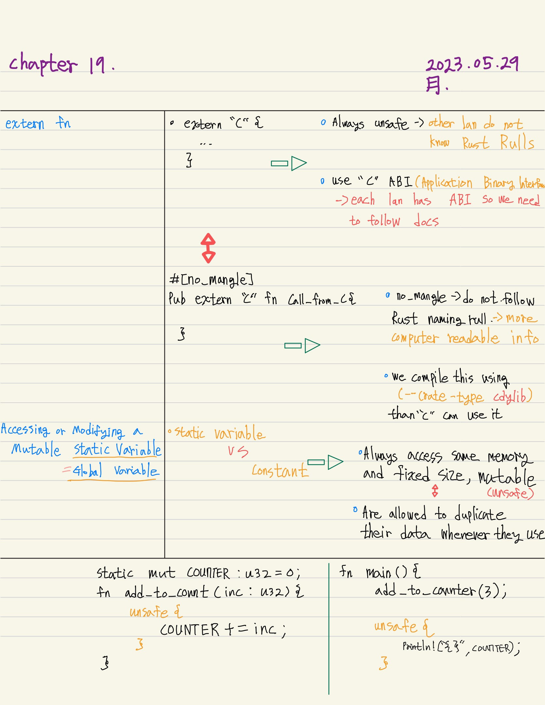
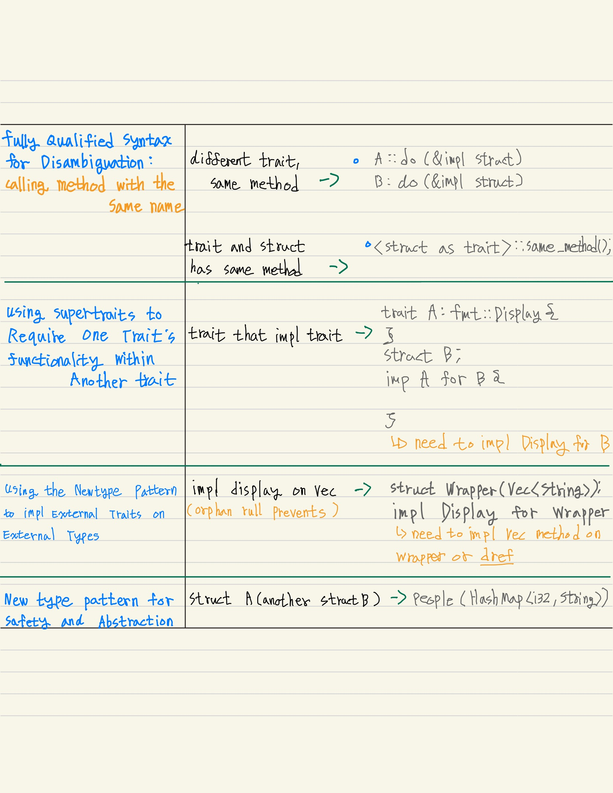
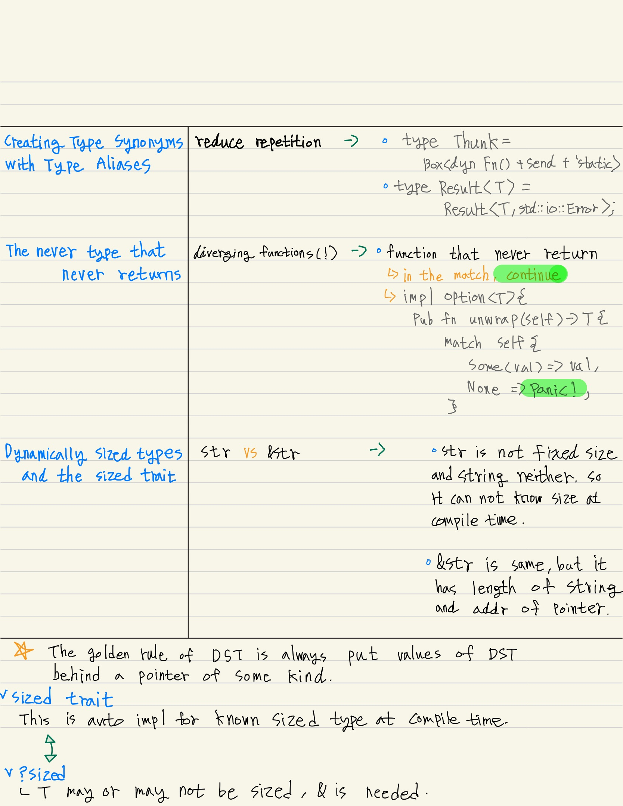
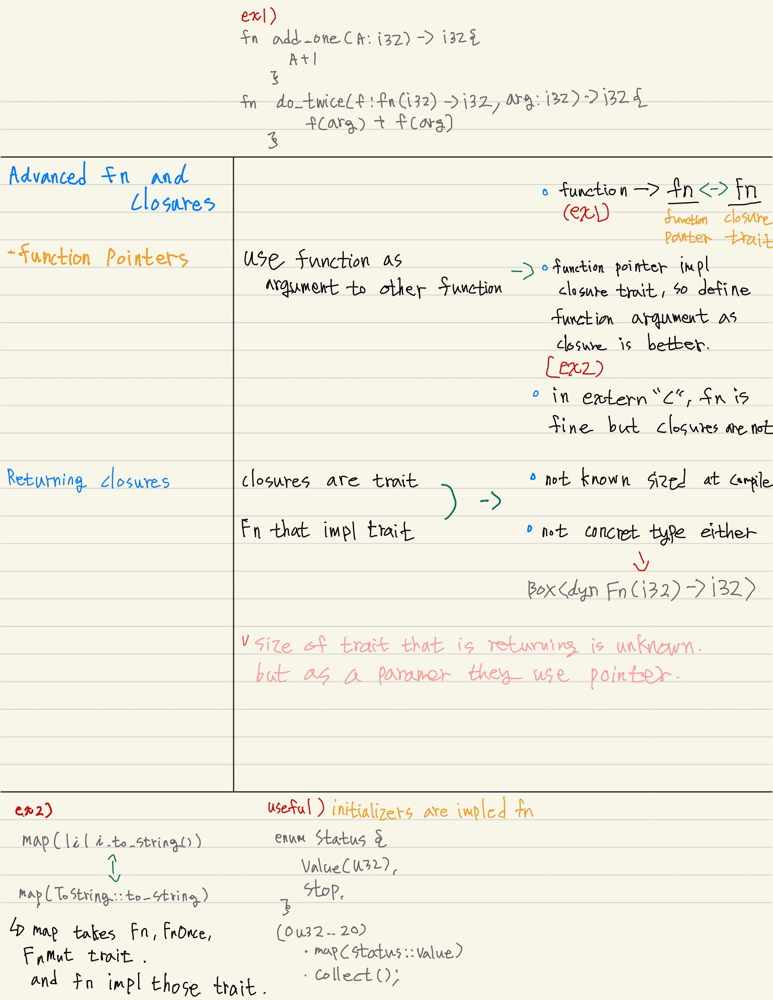
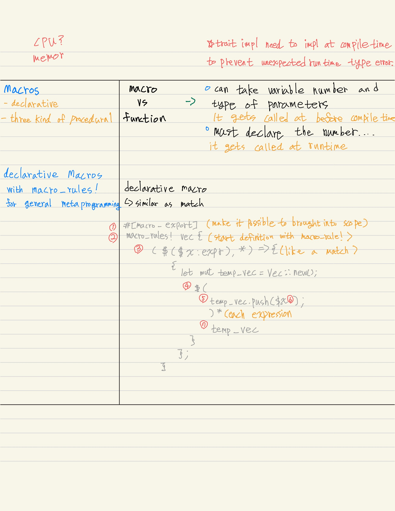
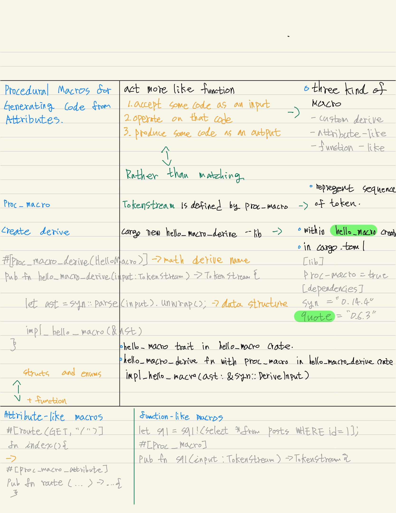

# Advanced Features, Ch 19


we will cover.. 

 1. **Unsafe Rust** How to opt out of some of Rust's guarantess and take responsibility for manually upholding those guarantees 

 2. **Advanced traits** Associated types, default type parameters, fully qualified syntax, supertraits, and newtype pattern in relation to traits 

 3. **Advanced types** More about the newtype pattern, type aliases, the never type, and dynamically sized types 

 4. **Advanced functions and closures** Function pointers and returning closures 

 5. **Macros** Ways to define code that defines more code at compile time 

thoes are panoply of Rust features that you should know. 


### Unsafe Rust 

so far, we've discussed Rust's memory safety guarantees enforced at compile time. 
other features that does not enforced at compile time. 
Unsafe Rust exists because of that static analysis is conservative.(in this context, static analysis means process of being analyzing code at compile time)
but if you use unsafe incollectly, problems due to memory unsafety, such as null pointer dereferencing, can occur. 


"Another reason Rust has an unsafe alter ego is that the underlying computer hardware is inherently unsafe"

"Rust can directly interact with the operating system or even writing your own operating system"

"working with low-level systems programming is one of the goals of the language"


#### unsafe superpowers 

* dereference a raw pointer 

* call an unsafe function or method 

* access or modify a mutable static variable 

* implement an unsafe trait 

#### what you need to know

* **unsafe** does not turn off the borrow checker or disable any other of Rust's safety checks.
* if you use a reference in unsafe code, it will still be checked. 
* **unsafe** keyword only give you access to these four features that are then not checked by the compiler for memory safety. 
* you will still get some degree of safety inside of an unsafe block. 


#### then why we annotate unsafe?
* you will know that any errors related to memory safety must be within an **unsafe** block, easy to find when you investigate memory bugs. 


it's best to enclose unsafe code within a safe abstraction and provide a safe API. (unsafe function, methods)


#### dereferencing a raw pointer 

ealier, the compiler ensures references are always valid. 

Usafe Rust has two new types 
* *raw pointers* : immutable - *const T, mutable - *mut T.  the asterisk isn't the dereference operator, it's part of the type name. 	ex) let raw_ptr = x as *const i32; *raw_ptr = other value; , can not be assigned. 

	* are allowed to ignore the borrowing rules by having both immutable and mutable pointers or multiple mutable pointers to the same location
	* are not guaranteed to point to valid memory 
	* are allowed to be null 
	* do not implement any automatic cleanup 
		* you can use these abilities for performance or interface with another language or hardware. 


```rust, editable

fn main() {

	let mut num = 5; 
	// raw pointer can create mutable and immutable reference at the same time 	
	let raw_ptr = &num as *const i32;
	
	let raw_ptr2 = &mut num as *mut i32;

	unsafe {

		println!("raw_ptr : {}", raw_ptr);
		println!("raw_ptr2 : {}", raw_ptr2);
	}
}

```


* can not derefernce raw pointers outside an unsafe block. 
* we can make assumption that raw pointer is valid because we created them directrly from references guaranteed, but we can not make that assumption about just any raw pointer. 


```rust, editable

fn main() {
	
	let addr = 0x012345usize;
	let r = addr as *const i32; 
	// we just created raw pointer from an arbitrary memory that is undefined. 
	// we can use raw pointer within unsafe block. 
}

```

* With raw pointers, we can create a mutable pointer and an immutable pointer to the same location. 
* it can potentially creating a data race so we need to be careful. 


use case. 
* interfacing with C code. 
* when building up safe abstractions that the borow checker does not understand. 


### Calling an Unsafe Function or Method 

the keyword "unsafe" means we has requirements we need to uphold when we call this function that Rust can not guarntee. 

```rust, editable

fn main() {

	unsafe fn danger_fn(){}

	unsafe {

		danger_fn();

	}

}

```

### Creating a Safe Abstraction over Unsafe Code 

wrapping unsafe code in a safe function is a common abstraction. 

```rust, editable


fn split_at_mut(slice : &mut [i32], mid : usize) -> (&mut [i32], &mut [i32]) {
	let len = slice.len();
	
	assert!(mid <= len);

	//(&mut slice[0..mid],
		&mut[mid..])

	// this code can not compile because we know slice of a and b are not overlaping but Rust does not know this. 

	let prt = slice.at_mut_ptr(); 
	
	unsafe {
		(slice::from_raw_parts_mut(ptr, mid),
			slice::from_raw_parts_mut(prt.add(mid), len - mid)) 
	}
	// second value of tuple's pointer location start at pointer plus mid and lenth of ramainer. 
}

fn main() {


	let mut v = vec![1,2,3,4,5,6];

	let r = &mut v[..];

	let (a, b) = r.split_at_mut(3);

	assert_eq!(a, &mut[1,2,3]);
	assert_eq!(a, &mut[4,5,6]);

	// this code now compile. 

}


```


```rust, editable 

fn main() {

	let addr = 0x012345usize;
	let r = addr as *mut i32; 

	let slice: &[i32] = unsafe {
	
		slice::from_raw_parts_mut(r, 10000)

	};

}

```

* Creating a slice from an arbitrary memory location. 
* in this case, 
	* we do not own the memory at this arbitrary location, 
	* and there is no guarantee that the slice this code creates contains valid i32 values. 
	* attemping to use slice as though it's a valid slice results in undefined behavior. 


### Using extern functions to call external code. 


* extern keyword( within extern blocks are always unsafe to call from Rust code).
	* other languages do not enforce Rust's rules and guarantees and Rust can not check them. 
* *use of a Foreign Function Interface (FFI)*









