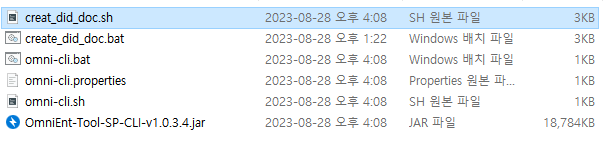
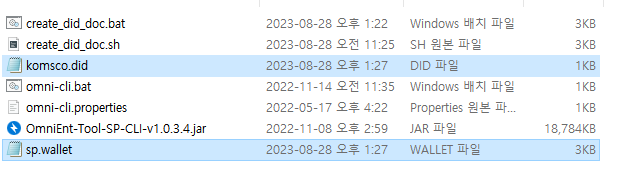

# DID document 생성하기. 

## 1. 사전 준비
  ### 1.1 파일 다운로드 및 환경 구성
  - DID 생성 파일 [Download](https://dev.mobileid.go.kr/mip/dfs/downapi/useguidedown.do)
    - 검색어에 파일명(`SP 서버 Wallet & DID 생성가이드`) 입력 후 조회

  - 환경 구성
        - 자바 설치 후 환경변수 설정
    

  ### 1.2 폴더 구성

 

  
## 2. 생성
  ### 참고사항
   
  서버 설정 시 필요한 항목(application.properties) 
   
  * `PASSWORD` - step 2 에서 진행
  * `ECC KEY ID` - step 3 에서 진행
  * `RSA KEY ID` - stpe 4 에서 진행
  * `wallet` 과 `did` 파일 - step 7 에서 진행

  
  ### Step 1. 생성 파일 실행
  - 리눅스 : `create_doc_linux.sh` 해당 파일 실행
  
 

  
  - 윈도우 : `create_doc_window.bat` 해당 파일 실행 
  
 

  ### Step 1.1 실행 후 화면
  
 

  개발 및 운영에 따라 `1` 또는 `2` 를 선택한다.

  ### Step 2. 패스워드 입력

 

`wallet` 생성에 필요한 비밀번호를 입력받는다.(예시: `komsco1`)
 

  ### Step 3. ECC KEY 입력

 

`wallet` 에 추가할 ECC KEY ID를 입력받는다.(예시: `komsco.sp`) 
  - 확장자는 `.sp`가 되어야 한다. 
  - default 값으로 하고 싶은 경우 `enter` 입력. 

  ### Step 4. RSA KEY 입력

 

`wallet` 에 추가할 RSA KEY ID를 입력받는다.(예시: `komsco.sp.rsa`) 
  - 확장자는 `.sp.rsa`가 되어야 한다. 
  - default 값으로 하고 싶은 경우 `enter` 를 입력. 

  ### Step 5. DID Document 파일명 입력

 

`DID Document` 파일명을 입력받는다.(예시: `komsco.did`) 
  - 확장자는 `.did`가 되어야 한다. 
  - default 값으로 하고 싶은 경우 `enter` 를 입력. 

  ### Step 6. 메시지 확인 

 

위와 같은 메시지가 나오면 성공적으로 생성이 되었다. 

  ### Step 7. 생성 파일 확인

 

- 해당 경로에서 `*.did` 와 `*.wallet` 파일을 확인할 수 있다. 

