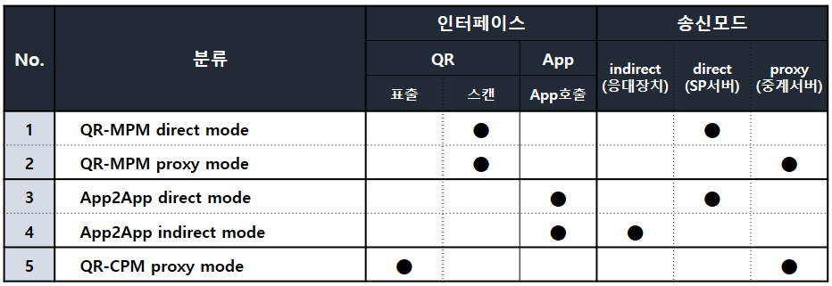

### 1. 개요
본 문서는 모바일 신분증을 이용한 서비스를 제공하고자 하는 SP(Service Provider)에게 다음의 정보를 제공함을 목적으로 한다.
* 모바일 신분증 검증 서비스 개요
* 연계 절차
* SP가 준비해야 할 항목
* 모바일 신분증 수행단 제공정보 및 기타
### 1.1. 용어 
* mDL
	* Mobile Driver License의 약어
	* 모바일 운전면허증 모바일 신분증
* 모바일로 발급한 국가 신분증
	* 현재는 모바일 운전면허증(mDL)만 있음 신분증앱
* 신분증앱
	* "모바일 신분증 앱"의 줄임말 
* 블록체인 계정
	* 블록체인 노드 상에서 참여자를 식별하기 위한 계정
	* 스마트 컨트랙트 호출을 위해 필요 
* 서비스 코드
	* Holder가 제출한 VP를 검증하기 위해 블록체인에 등록한 서비스 구분자
	* 매칭 정보: Verifier의 블록체인 계정, VC type, 검증할 개인정보 리스트 등 
* CLI (Command Line Interface)
	* 명령창에서 실행 가능한 툴
	* Wallet 및 DID 생성 (Decentralized ID) 탈중앙화된 신원
* DID (Decentralized ID) 
	* 탈중앙화된 신원
* DID Document (DID 문서)
	* DID의 요소로서 블록체인에 등록되어 누구나 조회 가능한 문서
	* DID 소유자의 id (예 - did:kr:mobileid:1234567890) 및 공개키 등이 저장됨 
	* W3C의 Decentralized Identifier v.1.0을 준수
* Holder
	* Issuer가 발급한 VC를 소유하는 주체
* Issuer
	* VC를 발급하는 주체
* Verififer
	* Holder가 제출한 VP를 검증하는 검증자
	* 일반적으로 서비스를 제공하는 SP(Service Provider)가 verifier 역할을 수행함
* VC (Verifiable Credential)
	* Issuer(발급자)가 holder의 요청에 의해 holder의 개인정보를 증명 가능한 형태로 발급한 문서 W3C의 Verifiable Credential Data Model v.1.0을 준수
* VP (Verifiable Presentation)
	* Holder가 서비스를 제공받거나 기타 용도로 VC를 verifier에게 제출하기 위해 작성하고 서명한 문서 
	* 여러 발급자의 여러 VC를 하나의 VP에 담을 수도 있음
* Wallet
	* 개인키를 담고 있는 파일 형태의 암호화 지갑
	* DID의 개인키를 보관하고 있어 SDK 연동시 반드시 필요

### 1.2. 모바일 신분증 검증 서비스
### 1.2.1. 이용 가능한 신분증
|   신분증   |   발급처  |          효력                                                           |
|------------|---------------------|---------------------------------------------------------------|
| 운전면허증 | 경찰청(도로교통공단)| - 대면 신원확인   - 대면/비대면 자격확인, 성인여부확인 등 운전면허증 상 정보제공|

* 대면 신원확인
	* Holder가 창구에 방문하거나 키오스크를 이용하는 등 검증자와 대면하는 경우
	* 이 경우에는 이름, 주민등록번호 등을 제출하여 신원을 확인하는 기능으로 이용 가능
	* 은행 홈페이지에 비회원 로그인 등 비대면 상황에서의 신원확인으로는 이용 불가함
* 대면/비대면 자격확인
	* 신원확인 이외의 운전면허 자격확인, 성인확인, 성별확인, 주소지 확인 등은 대면/비대면 모두 이용 가능

### 1.2.2. 인터페이스 & 송신모드

SP는 Holder에게 어떤 인터페이스와 송신모드로 VP를 제출받을지 미리 결정하여야 한다. 아래 표는 시범사업에서 선택 가능
한 인터페이스와 송신모드 목록이다.

 

인터페이스

| 인터페이스             | 설명 |비고|
|-------------------------|-|-|
| QR-MPM     | SP가 QR을 제시하고 holder가 촬영 | |
|App2pp      |Holder의 동일 스마트폰에 신분증앱과 SP용 서비스 앱간 직접 통신||
|QR-CPM      |Holder가 QR을 제시하고 SP가 촬영 |전자출입명부와 같은 방식 |전자출입명부와 같은 방식|

송신모드

|**모드** |**설명** | **비고** |
|-|-|-|
|**direct** |verifier서버에 VP 직접 제출| |
|**indirect** |**App2App** : 서비스앱으로 VP 제출||
|**proxy** | QR-CPM 이거나, verifier서버와의 통신이 불가하여 중계서버를 이용하고자 하는 경우 | 웹소켓 연결|
### 1.2.3. 수집정보(Claim)

#### 1.2.3.1 Claim 리스트

SP는Holder에게 다음의 정보(Claim)를 VP로 제출하도록 요청할 수 있다.

**[운전면허증VC]**

|코드|이름|타입|예시|
|-|-|-|-|
|name|이름|string|"홍길동"|
|ihidnum|주민등록번호|string|"8601021111111"|
|address|주소|string|"서울특별시종로구 XX대로 103"|
|birth|생년월일|string|"860102"|
|dlno|운전면허증번호|string|"10-20-123456-11"|
|asort|면허종별|(구분자사용)|string|"2종보통,2종원동기"|
|inspctbegend|적성검사시작,종료일자(구분자사용)|string|"20220101,20221231"|
|issude|발급일자|string|"20141010"|
|locpanm|지방경찰청명의|string|"서울경찰청장"|
|passwordsn|암호일련번호|string|"A1XY28"|
|inorgdonnyn|장기기증여부(구분사용)|string|"Y"|
|dlphotoimage|운전면허증사진이미지|hexstring|"2f396a...6b3d"|
|lcnscndcdnm|면허조건명(구분자사용)|string|"A,D"|

**[영지식VC]**

|코드|이름|설명|
|-|-|-|
|zkpaddr|영지식주소(시/군/구/동)|상세주소|없음|
|zkpsex|영지식|성별|
|zkpasort|영지식|면허종별(구분자사용)|
|zkpbirth|영지식|생년월일||

### 1.2.3.2. 제출 방식
서비스신청서에 제출받을 claim을 선택하여 기재한다. VP 제출 방식은 다음 2가지가 있다.
※일반 VC와 영지식 VC를 섞어서 제출할 수 없음

* 일반VP
	* 운전면허증VC에서 제출받을 claim을 선택
* Holder의DID와 서명이 포함되므로 제출자 식별이 가능
* 영지식VP
	* 영지식VC에서 제출받을 claim을 선택
	* Holder정보가 전혀 포함되지 않아 제출자 식별이 불가능
	* 예를들어, "영지식 생년월일(zkpbirth)"을 제출받을 경우 SP가 제시한 기준일보다 이전에 태어났는지 파악 가능
### 1.2.3.3. 서비스 코드

SP는 서비스 별로 제출받을 claim을 지정하여 1개 이상의 서비스 신청이 가능하다. 예를 들어,

* 서비스#1
	* 이름: 신원확인 서비스
	* Claims: 이름, 주민등록번호, 주소, 운전면허증사진이미지
* 서비스#2
	* 이름: 운전면허 자격확인 서비스
	* Claims: 이름, 운전면허증번호, 면허종별, 발급일자, 암호일련번호 

※ 단, 주민등록번호를 제출받으려면 해당 SP는 주민등록번호 수집이 가능한 기관이어야 함

### 1.2.4. 인증방식
Holder는 SP에게 VP를 제출하기 위해 제출동의 및 인증을 수행하여야 한다. 인증에는 다음의 방식이 있다.

|인증방식| 설명| 비고|
|-|-|-|
|PIN |비밀번호 인증||
|BIO |생체인증: 지문(Android),FaceID(iOS) | 운영체제에 따라 다름|
|FACE |안면인식 |운전면허증의 사진과 비교|

인증방식은 1개 이상 다중선택이 가능하며, 서비스코드 별로 인증방식을 지정하여야 한다.
