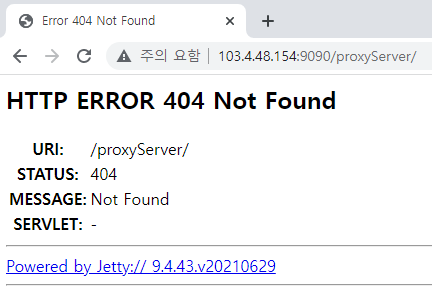

### 2. 준비 사항
### 2.1. 수행단 제공 서버 정보
서비스 제공에 필요한 서버는 다음과 같다.

|서버| IP | 포트|설명|
|-|-|-|-|
|(개발)읽기노드| 103.4.48.153 |18888 |SSL 미적용|
|(개발)중계서버 |103.4.48.154 |9090 | SSL 미적용, WebSocket 연결|

<span style="color:red">SP서버에서 접속이 가능하도록 방화벽 설정을 미리 해 두어야 한다. </span>

### 2.1.1. 읽기노드 접속 확인

#### 2.1.1.1. curl 이용

```console
1 | $ curl -v http://103.4.48.153:18888/v1/chain/get_info 
2 | * Trying 103.4.48.153...
3 | * TCP_NODELAY set
4 | * Connected to 103.4.48.153 (103.4.48.153) port 18888 (#0) 
5 | > GET /v1/chain/get_info HTTP/1.1
6 | > Host: 103.4.48.153:18888
7 | > User-Agent: curl/7.55.1
8 | > Accept: */*
9 | > 
10| < HTTP/1.1 200 OK 
11| < Access-Control-Allow-Headers: * 
12| < Access-Control-Allow-Origin: * 
13| < Connection: close 
14| < Content-Length: 793 
15| < Content-type: application/json 
16| < Server: WebSocket++/0.7.0
17| < 
18| {"server_version":"0d87dff8","chain_id":"101ece14e68c7a5c47565f352bfe
4633457f71b4452cddd81f5c11b221cccddb","head_block_num":4801403,
"last_irreversible_block_num":4801362, 
"last_irreversible_block_id":"00494352907a0ce8525167f500be7bf64df8b3db6f8996d903080a0 
165f6eca2",
"head_block_id":"0049437bbe3f10cea9b1c65bad14c2895dd422369a0079c5190758500 09560b3",
"head_block_time":"2021-11-23T07:57:56.000","head_block_producer":"producer1 ",
"virtual_block_cpu_limit":200000000,"virtual_block_net_limit":1048576000,
"block_cpu _limit":200000,"block_net_limit":1048576,"server_version_string":"v2.0.7",
"fork_db_he ad_block_num":4801403,"fork_db_head_block_id":
"0049437bbe3f10cea9b1c65bad14c2895dd422 369a0079c519075850009560b3",
"server_full_version_string":"v2.0.7-0d87dff8bee56179aa01 472dd00a089b2aa7b9fa-dirty"}
 * Closing connection 0
```

### 2-1-1-2 브라우저 이용

웹 브라우저에 아래 URL을 입력하여 응답 데이터를 확인한다.
```console
1 | http://103.4.48.153:18888/v1/chain/get_info
```

<p> </p>

### 2-1-2. 중계서버 접속 확인

#### 2.1.2.1. curl 이용 

```console
1 | $ curl -v http://103.4.48.154:9090/proxyServer 
2 | * Trying 103.4.48.154...
3 | * TCP_NODELAY set
4 | * Connected to 103.4.48.154 (103.4.48.154) port 9090 (#0) 
5 | > GET /proxyServer HTTP/1.1
6 | > Host: 103.4.48.154:9090
7 | > User-Agent: curl/7.55.1
8 | > Accept: */*
9 | > 
10| < HTTP/1.1 302 Found
11| < Date: Tue, 23 Nov 2021 08:02:02 GMT
12| < Location: http://103.4.48.154:9090/proxyServer/ 
13| < Content-Length: 0
14| < Server: Jetty(9.4.43.v20210629)
15| < 
16| * Connection #0 to host 103.4.48.154 left int

```

#### 2.1.2.2. 브라우저 이용

```console
1 | http://103.4.48.154:9090/proxyServer/
```

<p> </p>

