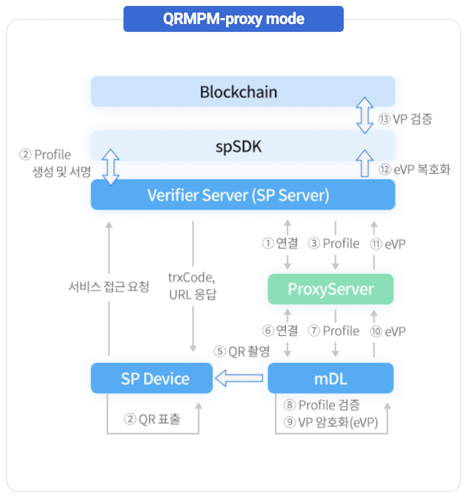

### 5 SP 검증 인터페이스 

#### 1. 동작 모드 설명

| 분류	|설명|
|-|-|
|Indirect Mode|응대 장치가 VP를 받아 SP서버에게 전달하여 VP검증을 수행하는 모드  암호화 필요| 
| Direct Mode | SP서버가 VP를 받아 검증을 수행하는 모드  응대 장치나 중계서버를 거치지 않기 때문에 암호화 필요 없음| 
| Proxy Mode | SP서버나 응대 장치가 중계서버를 통해 VP를 받는 모드   암호화 필요| 
| P2P Mode | 응대 장치가 VP를 받아 VP검증을 수행   응대 장치가 VP를 바로 받거나(P2P Mode) 중계서버를 통해 VP를 받을 수 있음(P2P Proxy Mode)| 

#### 1.1 QR MPM

* MPM 이란 Merchant Presentation Mode 의 약자이며 판매자 또는 서비스 제공자가 QR 을 제시하는 방법을 말한다.

	* MPM 의 경우 두 가지 인터페이스가 존재
		* Direct
		* Proxy 

#### 1.2 QR CPM 

* CPM 이란 Customer Presentation Mode 의 약자이며 판매자 또는 서비스 제공자가 QR 을 촬영하는 방법을 말한다. 

	* CPM 의 경우 Proxy 모드만 존재한다. 

#### 1.3 AppToApp

* AppToApp 이란 신분 검증을 하고자하는 App 에서 모바일 신분증 App 을 호출하여 검증하는 것을 말한다. 

	* AppToApp 의 경우 세 가지 인터페이스가 존재
		* Direct / Indirect 
		* App-proxy mode 

|mode|image|
|-|-|
|QR MPM Direct|

|
|설명|사용자가 PC Browser 이용 시, 검증자는 QR을 표시하고 모바일 신분증 앱은 QR에서 제공하는 URL에서 제출정보를 다운로드하고 검증자에게 직접 VP를 제출합니다.|
|QR MPM PROXY |

|
|설명|사용자가 PC Browser 이용 시, 검증자는 QR을 표시하고 모바일 신분증 앱은 QR에서 제공하는 URL에서 제출정보를 다운로드하고 중계서버를 통해서 검증자에게 VP를 제출합니다.|
|QR CPM PROXY |

|
|설명|CPM기반 QR을 이용할 경우, 거래코드와 중계서버 URL을 QR로 표출하고 검증자의 디바이스는 해당 거래코드와 URL을 기반으로 제출정보를 전달하고 모바일 신분증 앱은 중계서버를 통해 VP를 제출합니다.  영지식 증명 데이터가 아닌 DID기반 VP 제출시에는 QR 표출 후 사용자 인증이 필요합니다. |
|APP2APP DIRECT / INDIRECT|

|
|설명|사용자가 모바일 신분증 앱과 서비스 앱이 동일 디바이스 내에 설치되어 있는 경우, 앱간 통신으로 제출정보를 확인하고 검증자에게 직접 VP를 제출(direct) 혹은 호출한 앱으로 반환(indirect) 합니다.|
|APP2APP PROXY|

|
|설명|사용자가 PC Browser 이용 시, 검증자는 QR을 표시하고 모바일 신분증 앱은 QR에서 제공하는 URL에서 제출정보를다운로드하고 중계서버를 통해서 검증자에게 VP를 제출합니다.|

