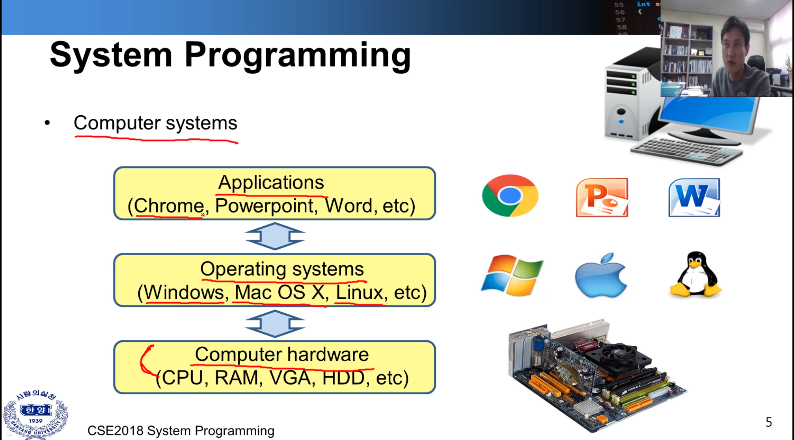
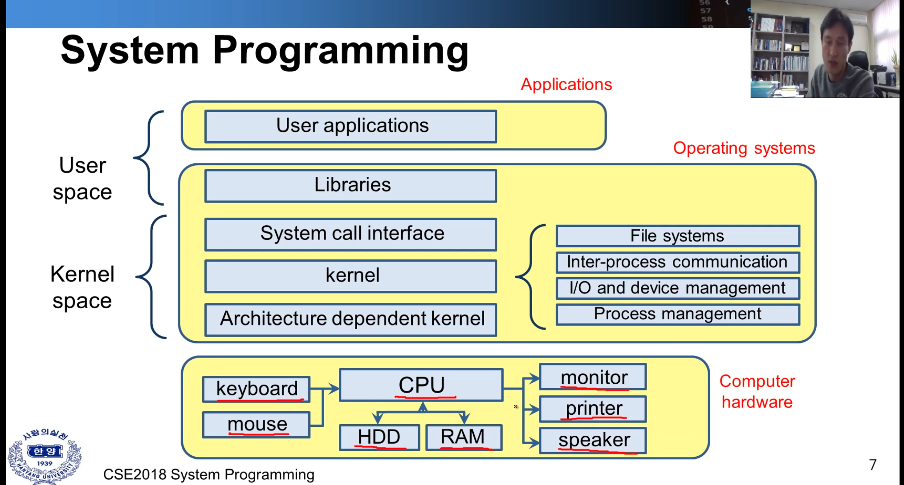

# lecture1

시스템 프로그래밍은 Embedded Software 또는 Hardware 부분에 속해 있다. 

* Software Curriculum
	* 컴퓨터 시스템 내에서 어떻게 적용이 되며 어떤 일이 일어나는지에 대해 고려하면서 프로그래밍 하는 것을 배운다.
	* 데이터 구조
	* 운영 체제(메모리 관리, os 기능 등)

* Hardware
	* 마이크로프로세서(하드웨어) 이해하고 프로그래밍하는 것이 중요
	* 컴퓨터 구조
	* 알고리즘 ( 데이터 구조에서 진보된 챕터)

* 배울 내용에 대해 간단히 도식화 해보자. 

|Computer systems | Embedded systems |
|-|-|
|

 | 

 |
| 내용 | 서로 다른 시스템이라 불리지만 흡사한 일련의 과정을 거쳐서 어플리케이션을 동작시킨다. |
| 궁금 | 하드웨어와 OS가 어떻게 동작하는지에 대해 궁금함.. |

* 하드웨어
	* 입력 장비 ( 키보드, 마우스) -> cpu (hdd, ram)
		* ex( cpu -> x86, arm..)
	* 출력 장비 (모니터, 프린터, 스피커)

* 운영체제 
	* 커널 스페이스

		* Architecture dependent kernel( 하드웨어와 가장 처음 맞닿는 영역, 하드웨어에 의존적)
		* 커널(운영체제의 코어 영역), *핵심은 파일시스템과 프로세스 관리
			* 파일 시스템(ex -exd2, 각 os 마다 사용하는 파일 시스템이 다름)
			* Inter-process communication ( 프로세스 간의 통신 - 추후 자세히 안내)
			* I/O and device management
			* Process management
		* System call interface ( api 같은, 함수화 되어 있는 기능, 파일 열기 등 )  
			
	* 유저 인터페이스 
		
		* Libraries ( system call interface lib )
		* User applications 

- 아래 표는 위의 내용 도식화한 것이다. 

* 하드웨어가 발전함에 따라 멀티 쓰레딩, 멀티 프로세싱도 함께 발전. 

* OS의 타입
	* 배치 
	* 멀티 프로그래밍 
	* 멀티프로세서
	* 분산 OS (물리적으로 컴퓨터가 분산된 상태에서 사용)
	* 리얼타임 OS (미사일 무기) 

* 이 수업에서는 Linux 를 주로 사용한다. 
	* 유닉스와 동일하게 동작한다. (단지 개인 피씨에서 사용됨)

* C Program Development Environment 

1. editor -> disk (코드 입력 및 저장)
2. Preprocessor -> disk ( 컴파일될 라이브러리, ex: include stdio.h .. 을 가져와 소스에 추가) 
3. Compiler -> disk (코드 메모리 영역에 배치, 코드를 어셈블리화 하고 바이너리(오브젝트코드) 를 만듦)
4. Linker -> disk (오브젝트를 코드를 다 붙인다. ex: inlclude 된 함수, 다른 곳에 있는 lib을 링크시킴)
5. Loader -> disk (실행, 메모리에 올림, 메모리 영역도 다섯가지 정도로 분산 배치 됨) 
6. cpu -> 하나하나 씩 읽어와서 코드를 실행시킴 

