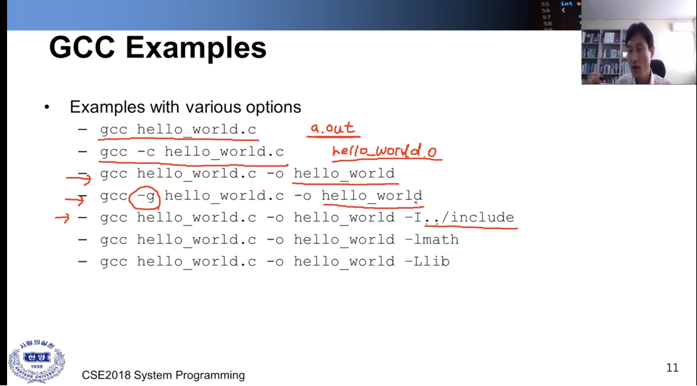
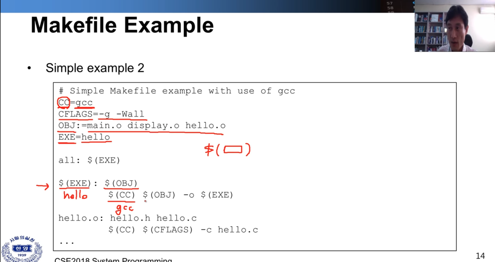
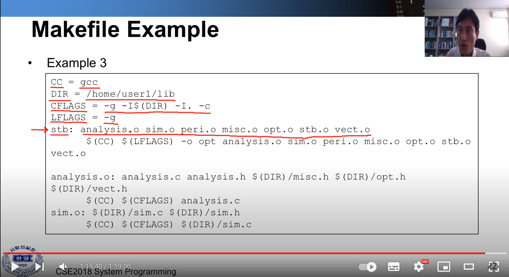

# lecture2

### about text editor 
vi 편집기는 패스! 이미 충분히 익숙함


### GCC 

* gnu c/c++ compiler 
* gcc is C code 
* g++ is C++ 
* console-based compiler (터미널에 커맨드 입력을 통해) 
* gcc perfoms the followings
	* preprocessing,
	* complilation,
	* assembly,
	* linking

* More Info, " man gcc "

### GCC Options ( or Flags)

* -c : perfomrs compilation and assembly of source file without linking.
	* outfile is object file, if it compiles with link, then output file is excutive file. 

* -o : specify output file name, if not specify the flag output file name is default. ex) a.out 

* -g : debug flag, 

* -Wall : show all warning. 

* -I<path> : specify the path where the headerfile is located. 

* -L<path> : specify the path where the libs is located.

* -l<libname> : specify the lib name.

* -Werror : Treat warning as errors. 

#### example 

<p></p>


<p></p>
<그림1>

<p></p>
<그림2>

* 그림1과 그림2는 alias 를 걸어둔 것만 차이가 있으며 동일하게 사용할 수 있다.

* compile 시 c에서 c++ 을 사용하거나 이름을 변경할 때 <그림2> 상단만 alias 부분만 수정하면 되서 편리함.


#### Componets of a makefile 

* Comments 
	* a comment is indicated by the character "#"
* Rules 
	* 2 lines. 
	```rs 
		hello.o : hello.c   // rull name : Dependency
			gcc -c hello.c  // 명령어 
	```
* Dependency Lines 

	``` 
	hello.exe: main.o hello.o  // dependency line 
		gcc main.o hello.o -o hello.exe 	
	```

* Shell Lines 

	``` 
	hello.exe: main.o hello.o  
		gcc main.o hello.o -o hello.exe // shell line, \t 이 필수 
	```

* Macro 
	```
	home = /home/user1 //alias 와 동일하게 사용가능
	lib = $(home) // 사용 시 $()  
	```
* Inference Rules 
	```
	%.o : %.c  // the "%" is used to indicate a wild card 
		$(cc) $ (FLAGS) -c $(SRC) 
	```
	

<p></p>

* 설명
cc = gcc
DIR = /home/user1/lib 
CFLAGS = -g -I$ (DIR) -I. -c   // compile 시 다른 옵션을 주기 위함 
LFLAGS = -g 
std : 룰 이름 / analysis.o 디펜던시 추가 


